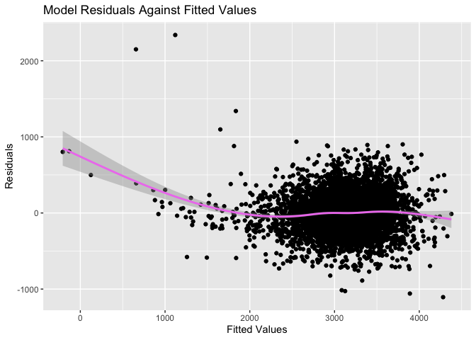
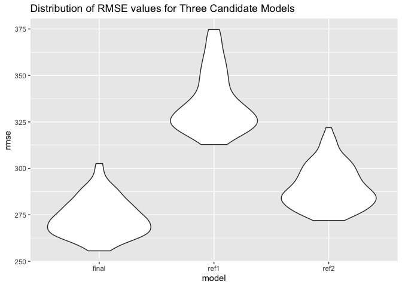
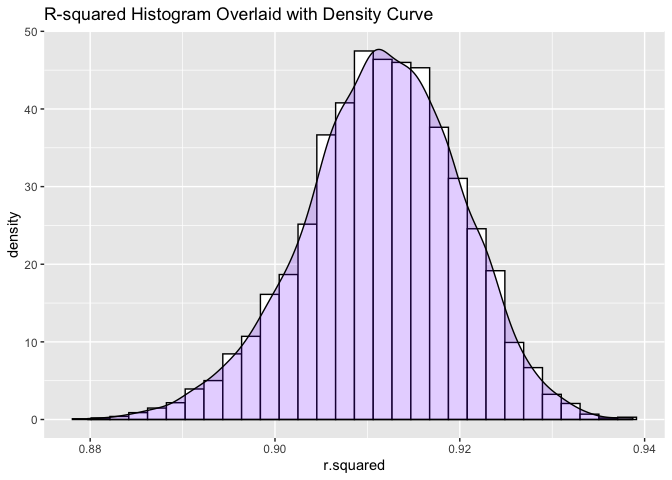
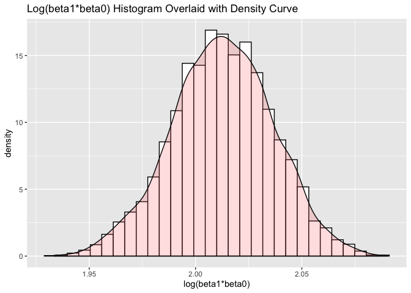

p8105\_hw6\_ml4420
================
Mengjia Lyu

## Problem 1

``` r
birthwt_data = read.csv("data/birthweight.csv") %>%
  janitor::clean_names() 

# check for missing values
sum(is.na(birthwt_data))
```

    ## [1] 0

``` r
birthwt_data = birthwt_data %>%
  na.omit() %>%
  mutate(babysex = recode_factor(babysex, `1` = "male", `2` = "female")) %>%
  mutate(frace = recode_factor(frace, `1` = "White", `2` = "Black", `3` = "Asian", 
                               `4` = "Puerto Rican", `8` = "Other", `9` = "Unknown")) %>%
  mutate(malform = recode_factor(malform, `0` = "absent", `1` = "present")) %>%
  mutate(mrace = recode_factor(mrace, `1` = "White", `2` = "Black", `3` = "Asian",
                               `4` = "Puerto Rican", `8` = "Other")) 


# fit a regression using all predictors
linear_mod = lm( bwt ~ ., data = birthwt_data) 
summary(linear_mod)
```

    ## 
    ## Call:
    ## lm(formula = bwt ~ ., data = birthwt_data)
    ## 
    ## Residuals:
    ##      Min       1Q   Median       3Q      Max 
    ## -1097.68  -184.86    -3.33   173.09  2344.15 
    ## 
    ## Coefficients: (3 not defined because of singularities)
    ##                     Estimate Std. Error t value Pr(>|t|)    
    ## (Intercept)       -6265.3914   660.4011  -9.487  < 2e-16 ***
    ## babysexfemale        28.7073     8.4652   3.391 0.000702 ***
    ## bhead               130.7781     3.4523  37.881  < 2e-16 ***
    ## blength              74.9536     2.0217  37.075  < 2e-16 ***
    ## delwt                 4.1007     0.3948  10.386  < 2e-16 ***
    ## fincome               0.2898     0.1795   1.614 0.106551    
    ## fraceBlack           14.3313    46.1501   0.311 0.756168    
    ## fraceAsian           21.2361    69.2960   0.306 0.759273    
    ## fracePuerto Rican   -46.9962    44.6782  -1.052 0.292912    
    ## fraceOther            4.2969    74.0741   0.058 0.953745    
    ## gaweeks              11.5494     1.4654   7.882 4.06e-15 ***
    ## malformpresent        9.7650    70.6259   0.138 0.890039    
    ## menarche             -3.5508     2.8951  -1.226 0.220083    
    ## mheight               9.7874    10.3116   0.949 0.342588    
    ## momage                0.7593     1.2221   0.621 0.534418    
    ## mraceBlack         -151.4354    46.0453  -3.289 0.001014 ** 
    ## mraceAsian          -91.3866    71.9190  -1.271 0.203908    
    ## mracePuerto Rican   -56.4787    45.1369  -1.251 0.210901    
    ## parity               95.5411    40.4793   2.360 0.018307 *  
    ## pnumlbw                   NA         NA      NA       NA    
    ## pnumsga                   NA         NA      NA       NA    
    ## ppbmi                 4.3538    14.8913   0.292 0.770017    
    ## ppwt                 -3.4716     2.6121  -1.329 0.183913    
    ## smoken               -4.8544     0.5871  -8.269  < 2e-16 ***
    ## wtgain                    NA         NA      NA       NA    
    ## ---
    ## Signif. codes:  0 '***' 0.001 '**' 0.01 '*' 0.05 '.' 0.1 ' ' 1
    ## 
    ## Residual standard error: 272.5 on 4320 degrees of freedom
    ## Multiple R-squared:  0.7183, Adjusted R-squared:  0.717 
    ## F-statistic: 524.6 on 21 and 4320 DF,  p-value: < 2.2e-16

We can see that the sum of missing values is 0, meaning there are no
missing values.

In the regression summary, we can see that there are three variables
(`pnumlbw`, `pnumsga`, `wtgain`) whose regression coefficients are not
defined because of singularities. To further investigate, we check if
the three variables are singular, or in other words, have zero variance.

``` r
var(pull(birthwt_data, pnumsga))
```

    ## [1] 0

``` r
var(pull(birthwt_data, pnumlbw))
```

    ## [1] 0

``` r
var(pull(birthwt_data, wtgain))
```

    ## [1] 119.7823

We find out that `pnumlbw` and `pnumgsa` have zero variance and thus are
not variables. Including them in the regression model would not help us
better predict the outcome as they do not carry any information.

``` r
linear_mod1 = lm( bwt ~ babysex + bhead + blength + bwt +
                   delwt + fincome + gaweeks + malform + 
                   menarche + mheight + momage + mrace +
                   parity + ppbmi + ppwt + smoken + frace + wtgain, data = birthwt_data) 
```

    ## Warning in model.matrix.default(mt, mf, contrasts): the response appeared on the
    ## right-hand side and was dropped

    ## Warning in model.matrix.default(mt, mf, contrasts): problem with term 4 in
    ## model.matrix: no columns are assigned

``` r
summary(linear_mod1)
```

    ## 
    ## Call:
    ## lm(formula = bwt ~ babysex + bhead + blength + bwt + delwt + 
    ##     fincome + gaweeks + malform + menarche + mheight + momage + 
    ##     mrace + parity + ppbmi + ppwt + smoken + frace + wtgain, 
    ##     data = birthwt_data)
    ## 
    ## Residuals:
    ##      Min       1Q   Median       3Q      Max 
    ## -1097.68  -184.86    -3.33   173.09  2344.15 
    ## 
    ## Coefficients: (1 not defined because of singularities)
    ##                     Estimate Std. Error t value Pr(>|t|)    
    ## (Intercept)       -6265.3914   660.4011  -9.487  < 2e-16 ***
    ## babysexfemale        28.7073     8.4652   3.391 0.000702 ***
    ## bhead               130.7781     3.4523  37.881  < 2e-16 ***
    ## blength              74.9536     2.0217  37.075  < 2e-16 ***
    ## delwt                 4.1007     0.3948  10.386  < 2e-16 ***
    ## fincome               0.2898     0.1795   1.614 0.106551    
    ## gaweeks              11.5494     1.4654   7.882 4.06e-15 ***
    ## malformpresent        9.7650    70.6259   0.138 0.890039    
    ## menarche             -3.5508     2.8951  -1.226 0.220083    
    ## mheight               9.7874    10.3116   0.949 0.342588    
    ## momage                0.7593     1.2221   0.621 0.534418    
    ## mraceBlack         -151.4354    46.0453  -3.289 0.001014 ** 
    ## mraceAsian          -91.3866    71.9190  -1.271 0.203908    
    ## mracePuerto Rican   -56.4787    45.1369  -1.251 0.210901    
    ## parity               95.5411    40.4793   2.360 0.018307 *  
    ## ppbmi                 4.3538    14.8913   0.292 0.770017    
    ## ppwt                 -3.4716     2.6121  -1.329 0.183913    
    ## smoken               -4.8544     0.5871  -8.269  < 2e-16 ***
    ## fraceBlack           14.3313    46.1501   0.311 0.756168    
    ## fraceAsian           21.2361    69.2960   0.306 0.759273    
    ## fracePuerto Rican   -46.9962    44.6782  -1.052 0.292912    
    ## fraceOther            4.2969    74.0741   0.058 0.953745    
    ## wtgain                    NA         NA      NA       NA    
    ## ---
    ## Signif. codes:  0 '***' 0.001 '**' 0.01 '*' 0.05 '.' 0.1 ' ' 1
    ## 
    ## Residual standard error: 272.5 on 4320 degrees of freedom
    ## Multiple R-squared:  0.7183, Adjusted R-squared:  0.717 
    ## F-statistic: 524.6 on 21 and 4320 DF,  p-value: < 2.2e-16

For `wtgain`, its regression coefficients are still not defined. This
indicates that our predictor variables are not all linearly independent;
in other words, collinearity exists. We can choose to exclude the
variable `wtgain` and the model should have the same coefficients as
before. Therefore, we take out `wtgain`.

``` r
linear_mod2 = lm( bwt ~ babysex + bhead + blength + bwt +
                   delwt + fincome + gaweeks + malform + 
                   menarche + mheight + momage + mrace +
                   parity + ppbmi + ppwt + smoken + frace, data = birthwt_data) 
```

    ## Warning in model.matrix.default(mt, mf, contrasts): the response appeared on the
    ## right-hand side and was dropped

    ## Warning in model.matrix.default(mt, mf, contrasts): problem with term 4 in
    ## model.matrix: no columns are assigned

``` r
summary(linear_mod2)
```

    ## 
    ## Call:
    ## lm(formula = bwt ~ babysex + bhead + blength + bwt + delwt + 
    ##     fincome + gaweeks + malform + menarche + mheight + momage + 
    ##     mrace + parity + ppbmi + ppwt + smoken + frace, data = birthwt_data)
    ## 
    ## Residuals:
    ##      Min       1Q   Median       3Q      Max 
    ## -1097.68  -184.86    -3.33   173.09  2344.15 
    ## 
    ## Coefficients:
    ##                     Estimate Std. Error t value Pr(>|t|)    
    ## (Intercept)       -6265.3914   660.4011  -9.487  < 2e-16 ***
    ## babysexfemale        28.7073     8.4652   3.391 0.000702 ***
    ## bhead               130.7781     3.4523  37.881  < 2e-16 ***
    ## blength              74.9536     2.0217  37.075  < 2e-16 ***
    ## delwt                 4.1007     0.3948  10.386  < 2e-16 ***
    ## fincome               0.2898     0.1795   1.614 0.106551    
    ## gaweeks              11.5494     1.4654   7.882 4.06e-15 ***
    ## malformpresent        9.7650    70.6259   0.138 0.890039    
    ## menarche             -3.5508     2.8951  -1.226 0.220083    
    ## mheight               9.7874    10.3116   0.949 0.342588    
    ## momage                0.7593     1.2221   0.621 0.534418    
    ## mraceBlack         -151.4354    46.0453  -3.289 0.001014 ** 
    ## mraceAsian          -91.3866    71.9190  -1.271 0.203908    
    ## mracePuerto Rican   -56.4787    45.1369  -1.251 0.210901    
    ## parity               95.5411    40.4793   2.360 0.018307 *  
    ## ppbmi                 4.3538    14.8913   0.292 0.770017    
    ## ppwt                 -3.4716     2.6121  -1.329 0.183913    
    ## smoken               -4.8544     0.5871  -8.269  < 2e-16 ***
    ## fraceBlack           14.3313    46.1501   0.311 0.756168    
    ## fraceAsian           21.2361    69.2960   0.306 0.759273    
    ## fracePuerto Rican   -46.9962    44.6782  -1.052 0.292912    
    ## fraceOther            4.2969    74.0741   0.058 0.953745    
    ## ---
    ## Signif. codes:  0 '***' 0.001 '**' 0.01 '*' 0.05 '.' 0.1 ' ' 1
    ## 
    ## Residual standard error: 272.5 on 4320 degrees of freedom
    ## Multiple R-squared:  0.7183, Adjusted R-squared:  0.717 
    ## F-statistic: 524.6 on 21 and 4320 DF,  p-value: < 2.2e-16

We can see that the coefficients for variables in the model indeed
remain the same, again reinforcing that `wtgain` is a redundant variable
for the model.

With all the variables having coefficients, we can now carry out
backward elimination, meaning that we take out non-significant variables
one at a time.

`fraceOther` has the highest p-value among all the covariates, but it
only represents a level of the categorical variable `frace`. We should
see whether the categorical variable `malform` as a whole is significant
or not, as we cannot include some categories of a variable and exclude
other categories. Therfore, we would like to carry out a test to compare
the two models with and without the categorical variable and check if
the difference is insignificant.

``` r
test_model = lm(bwt ~ babysex + bhead + blength + bwt +
                   delwt + fincome + gaweeks + malform + 
                   menarche + mheight + momage + mrace +
                   parity + ppbmi + ppwt + smoken, data = birthwt_data)
```

    ## Warning in model.matrix.default(mt, mf, contrasts): the response appeared on the
    ## right-hand side and was dropped

    ## Warning in model.matrix.default(mt, mf, contrasts): problem with term 4 in
    ## model.matrix: no columns are assigned

``` r
anova(linear_mod2, test_model)
```

    ## Analysis of Variance Table
    ## 
    ## Model 1: bwt ~ babysex + bhead + blength + bwt + delwt + fincome + gaweeks + 
    ##     malform + menarche + mheight + momage + mrace + parity + 
    ##     ppbmi + ppwt + smoken + frace
    ## Model 2: bwt ~ babysex + bhead + blength + bwt + delwt + fincome + gaweeks + 
    ##     malform + menarche + mheight + momage + mrace + parity + 
    ##     ppbmi + ppwt + smoken
    ##   Res.Df       RSS Df Sum of Sq      F Pr(>F)
    ## 1   4320 320724338                           
    ## 2   4324 320848704 -4   -124365 0.4188 0.7952

``` r
summary(test_model)
```

    ## 
    ## Call:
    ## lm(formula = bwt ~ babysex + bhead + blength + bwt + delwt + 
    ##     fincome + gaweeks + malform + menarche + mheight + momage + 
    ##     mrace + parity + ppbmi + ppwt + smoken, data = birthwt_data)
    ## 
    ## Residuals:
    ##     Min      1Q  Median      3Q     Max 
    ## -1097.2  -185.0    -3.4   173.5  2343.0 
    ## 
    ## Coefficients:
    ##                     Estimate Std. Error t value Pr(>|t|)    
    ## (Intercept)       -6275.7539   660.1055  -9.507  < 2e-16 ***
    ## babysexfemale        28.6774     8.4624   3.389 0.000708 ***
    ## bhead               130.7957     3.4498  37.914  < 2e-16 ***
    ## blength              74.9120     2.0205  37.075  < 2e-16 ***
    ## delwt                 4.0999     0.3945  10.392  < 2e-16 ***
    ## fincome               0.2900     0.1792   1.619 0.105601    
    ## gaweeks              11.5653     1.4649   7.895 3.65e-15 ***
    ## malformpresent        9.8604    70.6042   0.140 0.888937    
    ## menarche             -3.6117     2.8923  -1.249 0.211826    
    ## mheight               9.9748    10.3066   0.968 0.333191    
    ## momage                0.7549     1.2207   0.618 0.536323    
    ## mraceBlack         -137.2032    10.2150 -13.432  < 2e-16 ***
    ## mraceAsian          -73.8582    42.7892  -1.726 0.084402 .  
    ## mracePuerto Rican   -99.1585    19.3862  -5.115 3.28e-07 ***
    ## parity               95.6671    40.4678   2.364 0.018121 *  
    ## ppbmi                 4.5635    14.8839   0.307 0.759159    
    ## ppwt                 -3.5082     2.6110  -1.344 0.179136    
    ## smoken               -4.8281     0.5860  -8.239 2.29e-16 ***
    ## ---
    ## Signif. codes:  0 '***' 0.001 '**' 0.01 '*' 0.05 '.' 0.1 ' ' 1
    ## 
    ## Residual standard error: 272.4 on 4324 degrees of freedom
    ## Multiple R-squared:  0.7182, Adjusted R-squared:  0.7171 
    ## F-statistic: 648.3 on 17 and 4324 DF,  p-value: < 2.2e-16

Since p-value is bigger than 0.05, it means the difference is
significant and the variable `frace` should **not** be included in the
model.

Now the covariate with the highest p-value is `malformpresent`, which
only represents a level of the categorical variable `malform`. We should
see whether the categorical variable `malform` as a whole is significant
or not, as we cannot include some categories of a variable and exclude
other categories. Therfore, we would like to carry out a test to compare
the two models with and without the categorical variable and check if
the difference is insignificant.

``` r
test_model1 = lm(bwt ~ babysex + bhead + blength + bwt +
                   delwt + fincome + gaweeks +  
                   menarche + mheight + momage + mrace +
                   parity + ppbmi + ppwt + smoken, data = birthwt_data)
```

    ## Warning in model.matrix.default(mt, mf, contrasts): the response appeared on the
    ## right-hand side and was dropped

    ## Warning in model.matrix.default(mt, mf, contrasts): problem with term 4 in
    ## model.matrix: no columns are assigned

``` r
anova(test_model, test_model1)
```

    ## Analysis of Variance Table
    ## 
    ## Model 1: bwt ~ babysex + bhead + blength + bwt + delwt + fincome + gaweeks + 
    ##     malform + menarche + mheight + momage + mrace + parity + 
    ##     ppbmi + ppwt + smoken
    ## Model 2: bwt ~ babysex + bhead + blength + bwt + delwt + fincome + gaweeks + 
    ##     menarche + mheight + momage + mrace + parity + ppbmi + ppwt + 
    ##     smoken
    ##   Res.Df       RSS Df Sum of Sq      F Pr(>F)
    ## 1   4324 320848704                           
    ## 2   4325 320850151 -1   -1447.2 0.0195 0.8889

``` r
summary(test_model1)
```

    ## 
    ## Call:
    ## lm(formula = bwt ~ babysex + bhead + blength + bwt + delwt + 
    ##     fincome + gaweeks + menarche + mheight + momage + mrace + 
    ##     parity + ppbmi + ppwt + smoken, data = birthwt_data)
    ## 
    ## Residuals:
    ##      Min       1Q   Median       3Q      Max 
    ## -1097.12  -184.99    -3.41   173.48  2342.82 
    ## 
    ## Coefficients:
    ##                     Estimate Std. Error t value Pr(>|t|)    
    ## (Intercept)       -6274.6909   659.9868  -9.507  < 2e-16 ***
    ## babysexfemale        28.6599     8.4605   3.387 0.000712 ***
    ## bhead               130.7994     3.4493  37.920  < 2e-16 ***
    ## blength              74.9075     2.0201  37.082  < 2e-16 ***
    ## delwt                 4.1017     0.3943  10.403  < 2e-16 ***
    ## fincome               0.2895     0.1791   1.616 0.106120    
    ## gaweeks              11.5632     1.4646   7.895 3.65e-15 ***
    ## menarche             -3.6164     2.8917  -1.251 0.211146    
    ## mheight               9.9613    10.3049   0.967 0.333773    
    ## momage                0.7585     1.2203   0.622 0.534265    
    ## mraceBlack         -137.2323    10.2117 -13.439  < 2e-16 ***
    ## mraceAsian          -73.9192    42.7821  -1.728 0.084094 .  
    ## mracePuerto Rican   -99.2152    19.3798  -5.120 3.20e-07 ***
    ## parity               95.6426    40.4629   2.364 0.018137 *  
    ## ppbmi                 4.5479    14.8818   0.306 0.759922    
    ## ppwt                 -3.5073     2.6106  -1.343 0.179197    
    ## smoken               -4.8262     0.5858  -8.239 2.29e-16 ***
    ## ---
    ## Signif. codes:  0 '***' 0.001 '**' 0.01 '*' 0.05 '.' 0.1 ' ' 1
    ## 
    ## Residual standard error: 272.4 on 4325 degrees of freedom
    ## Multiple R-squared:  0.7182, Adjusted R-squared:  0.7172 
    ## F-statistic:   689 on 16 and 4325 DF,  p-value: < 2.2e-16

Since the p-value is greater than 0.05, it means the difference is
insignificant and the variable `malform` should not be included in the
model.

Now we take out `ppbmi` which is the covariate with the largest p-value.
Since it is a continuous variable, we need not to be concerned if it as
a whole is significant or not.

``` r
linear_mod3 = lm(bwt ~ babysex + bhead + blength + bwt +
                   delwt + fincome + gaweeks +  
                   menarche + mheight + momage + mrace +
                   parity + ppwt + smoken, data = birthwt_data)
```

    ## Warning in model.matrix.default(mt, mf, contrasts): the response appeared on the
    ## right-hand side and was dropped

    ## Warning in model.matrix.default(mt, mf, contrasts): problem with term 4 in
    ## model.matrix: no columns are assigned

``` r
summary(linear_mod3)
```

    ## 
    ## Call:
    ## lm(formula = bwt ~ babysex + bhead + blength + bwt + delwt + 
    ##     fincome + gaweeks + menarche + mheight + momage + mrace + 
    ##     parity + ppwt + smoken, data = birthwt_data)
    ## 
    ## Residuals:
    ##      Min       1Q   Median       3Q      Max 
    ## -1095.57  -185.07    -3.22   173.66  2342.79 
    ## 
    ## Coefficients:
    ##                     Estimate Std. Error t value Pr(>|t|)    
    ## (Intercept)       -6077.6038   140.2391 -43.337  < 2e-16 ***
    ## babysexfemale        28.6376     8.4593   3.385 0.000717 ***
    ## bhead               130.8308     3.4474  37.950  < 2e-16 ***
    ## blength              74.9102     2.0198  37.087  < 2e-16 ***
    ## delwt                 4.1004     0.3942  10.402  < 2e-16 ***
    ## fincome               0.2905     0.1791   1.622 0.104816    
    ## gaweeks              11.5597     1.4644   7.894 3.69e-15 ***
    ## menarche             -3.6401     2.8904  -1.259 0.207963    
    ## mheight               6.8604     1.7989   3.814 0.000139 ***
    ## momage                0.7656     1.2199   0.628 0.530319    
    ## mraceBlack         -137.2019    10.2102 -13.438  < 2e-16 ***
    ## mraceAsian          -74.6165    42.7167  -1.747 0.080747 .  
    ## mracePuerto Rican   -99.4288    19.3652  -5.134 2.95e-07 ***
    ## parity               95.4592    40.4542   2.360 0.018335 *  
    ## ppwt                 -2.7205     0.4325  -6.290 3.50e-10 ***
    ## smoken               -4.8279     0.5857  -8.243  < 2e-16 ***
    ## ---
    ## Signif. codes:  0 '***' 0.001 '**' 0.01 '*' 0.05 '.' 0.1 ' ' 1
    ## 
    ## Residual standard error: 272.3 on 4326 degrees of freedom
    ## Multiple R-squared:  0.7182, Adjusted R-squared:  0.7172 
    ## F-statistic: 735.1 on 15 and 4326 DF,  p-value: < 2.2e-16

Now we take out `momage` which is the covariate with the largest
p-value. Since it is a continuous variable, we need not to be concerned
if it as a whole is significant or not.

``` r
linear_mod4 = lm(bwt ~ babysex + bhead + blength + bwt +
                   delwt + fincome + gaweeks +  
                   menarche + mheight + mrace +
                   parity + ppwt + smoken, data = birthwt_data)
```

    ## Warning in model.matrix.default(mt, mf, contrasts): the response appeared on the
    ## right-hand side and was dropped

    ## Warning in model.matrix.default(mt, mf, contrasts): problem with term 4 in
    ## model.matrix: no columns are assigned

``` r
summary(linear_mod4)
```

    ## 
    ## Call:
    ## lm(formula = bwt ~ babysex + bhead + blength + bwt + delwt + 
    ##     fincome + gaweeks + menarche + mheight + mrace + parity + 
    ##     ppwt + smoken, data = birthwt_data)
    ## 
    ## Residuals:
    ##      Min       1Q   Median       3Q      Max 
    ## -1096.14  -184.98    -2.86   173.65  2343.59 
    ## 
    ## Coefficients:
    ##                     Estimate Std. Error t value Pr(>|t|)    
    ## (Intercept)       -6070.1897   139.7308 -43.442  < 2e-16 ***
    ## babysexfemale        28.4769     8.4548   3.368 0.000763 ***
    ## bhead               130.8513     3.4470  37.961  < 2e-16 ***
    ## blength              74.8931     2.0195  37.085  < 2e-16 ***
    ## delwt                 4.0794     0.3927  10.387  < 2e-16 ***
    ## fincome               0.3149     0.1748   1.802 0.071621 .  
    ## gaweeks              11.6105     1.4621   7.941 2.54e-15 ***
    ## menarche             -3.2979     2.8383  -1.162 0.245327    
    ## mheight               6.8542     1.7988   3.810 0.000141 ***
    ## mraceBlack         -138.7506     9.9068 -14.006  < 2e-16 ***
    ## mraceAsian          -71.4559    42.4158  -1.685 0.092128 .  
    ## mracePuerto Rican  -100.1555    19.3291  -5.182 2.30e-07 ***
    ## parity               97.3088    40.3438   2.412 0.015907 *  
    ## ppwt                 -2.6787     0.4273  -6.268 4.01e-10 ***
    ## smoken               -4.8305     0.5857  -8.248  < 2e-16 ***
    ## ---
    ## Signif. codes:  0 '***' 0.001 '**' 0.01 '*' 0.05 '.' 0.1 ' ' 1
    ## 
    ## Residual standard error: 272.3 on 4327 degrees of freedom
    ## Multiple R-squared:  0.7182, Adjusted R-squared:  0.7173 
    ## F-statistic: 787.7 on 14 and 4327 DF,  p-value: < 2.2e-16

Now we take out `menarche` which is the covariate with the largest
p-value. Since it is a continuous variable, we need not to be concerned
if it as a whole is significant or not.

``` r
linear_mod5 = lm(bwt ~ babysex + bhead + blength + bwt +
                   delwt + fincome + gaweeks +  
                   mheight + mrace +
                   parity + ppwt + smoken, data = birthwt_data)
```

    ## Warning in model.matrix.default(mt, mf, contrasts): the response appeared on the
    ## right-hand side and was dropped

    ## Warning in model.matrix.default(mt, mf, contrasts): problem with term 4 in
    ## model.matrix: no columns are assigned

``` r
summary(linear_mod5)
```

    ## 
    ## Call:
    ## lm(formula = bwt ~ babysex + bhead + blength + bwt + delwt + 
    ##     fincome + gaweeks + mheight + mrace + parity + ppwt + smoken, 
    ##     data = birthwt_data)
    ## 
    ## Residuals:
    ##      Min       1Q   Median       3Q      Max 
    ## -1097.18  -185.52    -3.39   174.14  2353.44 
    ## 
    ## Coefficients:
    ##                     Estimate Std. Error t value Pr(>|t|)    
    ## (Intercept)       -6098.8219   137.5463 -44.340  < 2e-16 ***
    ## babysexfemale        28.5580     8.4549   3.378 0.000737 ***
    ## bhead               130.7770     3.4466  37.944  < 2e-16 ***
    ## blength              74.9471     2.0190  37.120  < 2e-16 ***
    ## delwt                 4.1067     0.3921  10.475  < 2e-16 ***
    ## fincome               0.3180     0.1747   1.820 0.068844 .  
    ## gaweeks              11.5925     1.4621   7.929 2.79e-15 ***
    ## mheight               6.5940     1.7849   3.694 0.000223 ***
    ## mraceBlack         -138.7925     9.9071 -14.009  < 2e-16 ***
    ## mraceAsian          -74.8868    42.3146  -1.770 0.076837 .  
    ## mracePuerto Rican  -100.6781    19.3247  -5.210 1.98e-07 ***
    ## parity               96.3047    40.3362   2.388 0.017004 *  
    ## ppwt                 -2.6756     0.4274  -6.261 4.20e-10 ***
    ## smoken               -4.8434     0.5856  -8.271  < 2e-16 ***
    ## ---
    ## Signif. codes:  0 '***' 0.001 '**' 0.01 '*' 0.05 '.' 0.1 ' ' 1
    ## 
    ## Residual standard error: 272.3 on 4328 degrees of freedom
    ## Multiple R-squared:  0.7181, Adjusted R-squared:  0.7173 
    ## F-statistic: 848.1 on 13 and 4328 DF,  p-value: < 2.2e-16

`mraceAsian`, which only represents a level of the categorical variable
`mrace`, is the covariate with the highest p-value. We should see
whether the categorical variable `mrace` as a whole is significant or
not, as we cannot include some categories of a variable and exclude
other categories. Therfore, we would like to carry out a test to compare
the two models with and without the categorical variable and check if
the difference is insignificant.

``` r
test_model2 = lm(bwt ~ babysex + bhead + blength + bwt +
                   delwt + fincome + gaweeks +  
                   mheight + 
                   parity + ppwt + smoken, data = birthwt_data)
```

    ## Warning in model.matrix.default(mt, mf, contrasts): the response appeared on the
    ## right-hand side and was dropped

    ## Warning in model.matrix.default(mt, mf, contrasts): problem with term 4 in
    ## model.matrix: no columns are assigned

``` r
anova(linear_mod5, test_model2)
```

    ## Analysis of Variance Table
    ## 
    ## Model 1: bwt ~ babysex + bhead + blength + bwt + delwt + fincome + gaweeks + 
    ##     mheight + mrace + parity + ppwt + smoken
    ## Model 2: bwt ~ babysex + bhead + blength + bwt + delwt + fincome + gaweeks + 
    ##     mheight + parity + ppwt + smoken
    ##   Res.Df       RSS Df Sum of Sq      F    Pr(>F)    
    ## 1   4328 320986412                                  
    ## 2   4331 335670021 -3 -14683609 65.995 < 2.2e-16 ***
    ## ---
    ## Signif. codes:  0 '***' 0.001 '**' 0.01 '*' 0.05 '.' 0.1 ' ' 1

``` r
summary(linear_mod5)
```

    ## 
    ## Call:
    ## lm(formula = bwt ~ babysex + bhead + blength + bwt + delwt + 
    ##     fincome + gaweeks + mheight + mrace + parity + ppwt + smoken, 
    ##     data = birthwt_data)
    ## 
    ## Residuals:
    ##      Min       1Q   Median       3Q      Max 
    ## -1097.18  -185.52    -3.39   174.14  2353.44 
    ## 
    ## Coefficients:
    ##                     Estimate Std. Error t value Pr(>|t|)    
    ## (Intercept)       -6098.8219   137.5463 -44.340  < 2e-16 ***
    ## babysexfemale        28.5580     8.4549   3.378 0.000737 ***
    ## bhead               130.7770     3.4466  37.944  < 2e-16 ***
    ## blength              74.9471     2.0190  37.120  < 2e-16 ***
    ## delwt                 4.1067     0.3921  10.475  < 2e-16 ***
    ## fincome               0.3180     0.1747   1.820 0.068844 .  
    ## gaweeks              11.5925     1.4621   7.929 2.79e-15 ***
    ## mheight               6.5940     1.7849   3.694 0.000223 ***
    ## mraceBlack         -138.7925     9.9071 -14.009  < 2e-16 ***
    ## mraceAsian          -74.8868    42.3146  -1.770 0.076837 .  
    ## mracePuerto Rican  -100.6781    19.3247  -5.210 1.98e-07 ***
    ## parity               96.3047    40.3362   2.388 0.017004 *  
    ## ppwt                 -2.6756     0.4274  -6.261 4.20e-10 ***
    ## smoken               -4.8434     0.5856  -8.271  < 2e-16 ***
    ## ---
    ## Signif. codes:  0 '***' 0.001 '**' 0.01 '*' 0.05 '.' 0.1 ' ' 1
    ## 
    ## Residual standard error: 272.3 on 4328 degrees of freedom
    ## Multiple R-squared:  0.7181, Adjusted R-squared:  0.7173 
    ## F-statistic: 848.1 on 13 and 4328 DF,  p-value: < 2.2e-16

Since p-value is less than 0.5, it means the difference is significant
and the variable `mrace` should be included in the model.

Now we take out `fincome` which is the covariate with the highest
p-value. Since it is a continuous variable, we need not to be concerned
if it as a whole is significant or not.

``` r
linear_mod6 = lm(bwt ~ babysex + bhead + blength + bwt +
                   delwt + gaweeks +
                   mheight + mrace +
                   parity + ppwt + smoken, data = birthwt_data)
```

    ## Warning in model.matrix.default(mt, mf, contrasts): the response appeared on the
    ## right-hand side and was dropped

    ## Warning in model.matrix.default(mt, mf, contrasts): problem with term 4 in
    ## model.matrix: no columns are assigned

``` r
summary(linear_mod6)
```

    ## 
    ## Call:
    ## lm(formula = bwt ~ babysex + bhead + blength + bwt + delwt + 
    ##     gaweeks + mheight + mrace + parity + ppwt + smoken, data = birthwt_data)
    ## 
    ## Residuals:
    ##      Min       1Q   Median       3Q      Max 
    ## -1106.16  -183.65    -2.51   174.67  2338.68 
    ## 
    ## Coefficients:
    ##                     Estimate Std. Error t value Pr(>|t|)    
    ## (Intercept)       -6101.8188   137.5732 -44.353  < 2e-16 ***
    ## babysexfemale        28.3735     8.4565   3.355 0.000800 ***
    ## bhead               131.0228     3.4448  38.035  < 2e-16 ***
    ## blength              74.7933     2.0178  37.066  < 2e-16 ***
    ## delwt                 4.0840     0.3920  10.419  < 2e-16 ***
    ## gaweeks              11.6785     1.4617   7.990 1.72e-15 ***
    ## mheight               6.8569     1.7795   3.853 0.000118 ***
    ## mraceBlack         -145.3753     9.2256 -15.758  < 2e-16 ***
    ## mraceAsian          -77.9781    42.2918  -1.844 0.065279 .  
    ## mracePuerto Rican  -105.9871    19.1083  -5.547 3.09e-08 ***
    ## parity               94.8103    40.3386   2.350 0.018800 *  
    ## ppwt                 -2.6507     0.4273  -6.204 6.02e-10 ***
    ## smoken               -4.8738     0.5855  -8.324  < 2e-16 ***
    ## ---
    ## Signif. codes:  0 '***' 0.001 '**' 0.01 '*' 0.05 '.' 0.1 ' ' 1
    ## 
    ## Residual standard error: 272.4 on 4329 degrees of freedom
    ## Multiple R-squared:  0.7179, Adjusted R-squared:  0.7171 
    ## F-statistic:   918 on 12 and 4329 DF,  p-value: < 2.2e-16

Since all the covariates are significant (`mrace` as a whole is
significant even though `mraceAsian` is not), we stop here and conclude
it to be our final model.

``` r
birthwt_data %>%
  modelr::add_predictions(linear_mod6) %>%
  modelr::add_residuals(linear_mod6) %>%
  ggplot(aes(x = pred,y = resid)) +
  geom_point() +
  geom_smooth(color = "violet") +
  labs(
    x = "Fitted Values",
    y = "Residuals",
    title = "Model Residuals Against Fitted Values"
  )
```

<!-- -->

``` r
# compare with other models
reference_model1 = lm(bwt~ blength + gaweeks, data = birthwt_data)

reference_model2 = lm(bwt ~ bhead*blength*babysex, data = birthwt_data)

cv_df =
  crossv_mc(birthwt_data, 100) %>% 
  mutate(
    train = map(train, as_tibble),
    test = map(test, as_tibble))

cv_df = 
  cv_df %>% 
  mutate(final_mod  = map(train, ~lm(bwt ~ babysex + bhead + blength + bwt +
                                      delwt + gaweeks + mheight + mrace +
                                      parity + ppwt + smoken, data = .x)),
         ref_mod1     = map(train, ~lm(bwt ~ blength + gaweeks, data = .x)),
         ref_mod2  = map(train, ~lm(bwt ~ bhead*blength*babysex, data = .x))) %>% 
  mutate(rmse_final = map2_dbl(final_mod, test, ~rmse(model = .x, data = .y)),
         rmse_ref1    = map2_dbl(ref_mod1, test, ~rmse(model = .x, data = .y)),
         rmse_ref2 = map2_dbl(ref_mod2, test, ~rmse(model = .x, data = .y)))

cv_df %>% 
  select(starts_with("rmse")) %>% 
  pivot_longer(
    everything(),
    names_to = "model", 
    values_to = "rmse",
    names_prefix = "rmse_") %>% 
  mutate(model = fct_inorder(model)) %>% 
  ggplot(aes(x = model, y = rmse)) + 
  geom_violin() +
  ggtitle("Distribution of RMSE values for Three Candidate Models")
```

<!-- -->

The RMSE is the standard deviation of prediction errors. From the violin
graph, we can see that the model with the smallest variance in
prediction errors is the model we built from backward elimination\! The
reference model with birth and gestational age as predictors (main
effects only) have the highest variance in prediction errors. The
reference model using head circumference, length, sex and all
interactions between these has a slighter higher variance in the
distribution of prediction errors than our final model.

## Problem 2

``` r
weather_df = 
  rnoaa::meteo_pull_monitors(
    c("USW00094728"),
    var = c("PRCP", "TMIN", "TMAX"), 
    date_min = "2017-01-01",
    date_max = "2017-12-31") %>%
  mutate(
    name = recode(id, USW00094728 = "CentralPark_NY"),
    tmin = tmin / 10,
    tmax = tmax / 10) %>%
  select(name, id, everything())
```

    ## Registered S3 method overwritten by 'crul':
    ##   method                 from
    ##   as.character.form_file httr

    ## Registered S3 method overwritten by 'hoardr':
    ##   method           from
    ##   print.cache_info httr

    ## file path:          /Users/mengjialyu/Library/Caches/rnoaa/ghcnd/USW00094728.dly

    ## file last updated:  2019-11-22 10:19:18

    ## file min/max dates: 1869-01-01 / 2019-11-30

``` r
rs_df =
  weather_df %>% 
  modelr::bootstrap(n = 5000) %>% 
  mutate(
    models = map(strap, ~lm(tmax ~ tmin, data = .x) ),
    results = map(models, broom::glance)) %>% 
  select(-strap, -models) %>% 
  unnest(results) 

# r.square histogram overlaid with kernel density curve
ggplot(rs_df, aes(x=r.squared)) + 
    geom_histogram(aes(y=..density..),      # Histogram with density instead of count on y-axis
                       colour="black", fill="white") +
    geom_density(alpha=.2, fill="#7F00FF") +
    ggtitle("R-squared Histogram Overlaid with Density Curve")# Overlay with transparent density plot
```

    ## `stat_bin()` using `bins = 30`. Pick better value with `binwidth`.

<!-- -->

``` r
beta_df = weather_df %>% 
  modelr::bootstrap(n = 5000) %>% 
  mutate(
    models = map(strap, ~lm(tmax ~ tmin, data = .x) ),
    results = map(models, broom::tidy)) %>% 
  select(-strap, -models) %>% 
  unnest(results) %>%
  group_by(.id) %>%
  select(.id, term, estimate) %>%
  pivot_wider(
    names_from = term,
    values_from = estimate
  )  %>%
  rename( beta_0 = "(Intercept)" ,
          beta_1 = tmin) %>%
  mutate(
    log_beta = log(beta_0*beta_1)
  ) 

# log beta1*beta0 histogram overlaid with kernel density curve
ggplot(beta_df, aes(x=log_beta)) + 
    geom_histogram(aes(y=..density..),      # Histogram with density instead of count on y-axis
                   
                   colour="black", fill="white") +
    geom_density(alpha=.2, fill="#FF6666") +
    ggtitle("Log(beta1*beta0) Histogram Overlaid with Density Curve") +
    xlab("log(beta1*beta0)")# Overlay with transparent density plot
```

    ## `stat_bin()` using `bins = 30`. Pick better value with `binwidth`.

<!-- -->

We can see from the two graphs that estimates for both R-squared and
log(beta0\*beta1) are approximately normally distributed.

The distribution of R-squared lies in the high range between 0.88 and
0.94, meaning that most of the variation of `tmax` is explained by
`tmin` in a regression model.

That the distribution of estimates for log(beta0\*beta1) is
approximately normal indicates that the product of regression slope and
intercept follows a log-normal distribution.

``` r
quantile(pull(rs_df, r.squared), probs=c(0.025, 0.975))
```

    ##      2.5%     97.5% 
    ## 0.8935166 0.9270503

``` r
quantile(pull(beta_df, log_beta), probs=c(0.025, 0.975))
```

    ##     2.5%    97.5% 
    ## 1.964233 2.058874

The 2.5% and 97.5% quantiles for R-squared estimates are 0.8935166 and
0.9270503 respectively. Therefore the 95% confidence interval for
R-squared estimates is \[0.8935166, 0.9270503\].

The 2.5% and 97.5% quantiles for log(beta0\*beta1) estimates are
1.9642327 and 2.0588743 respectively. Therefore the 95% confidence
interval for it is \[1.9642327, 2.0588743\].
